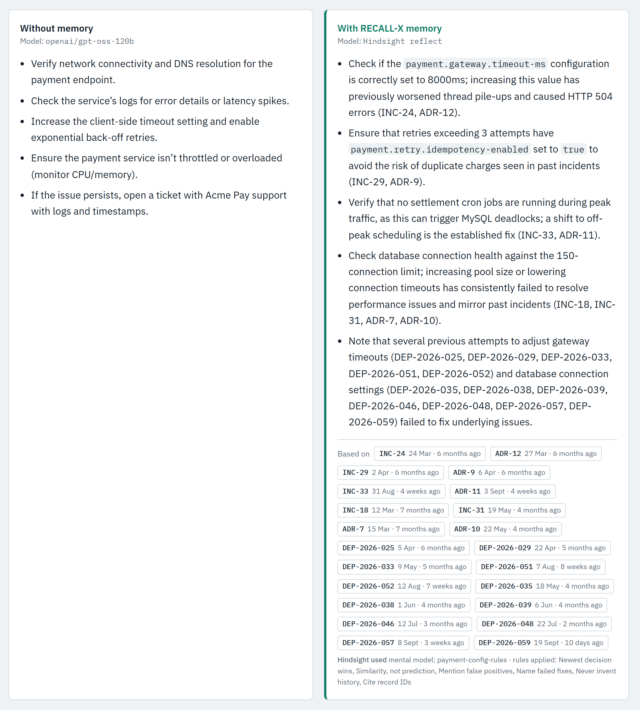
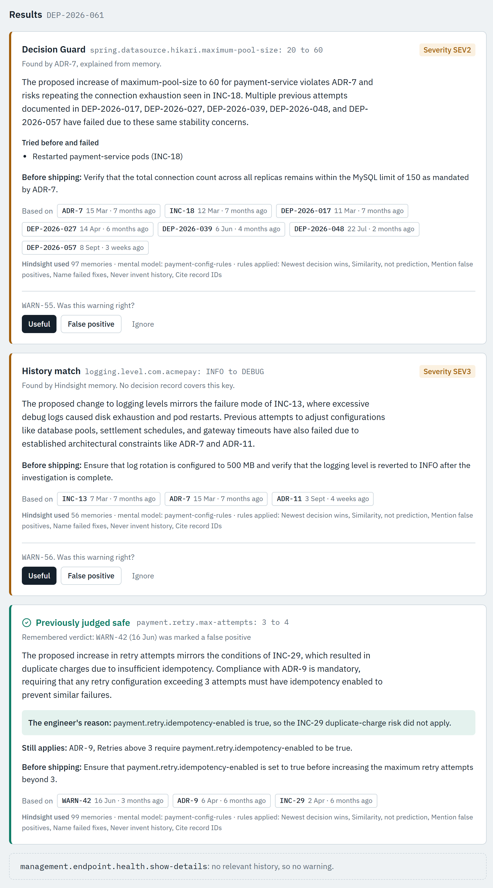
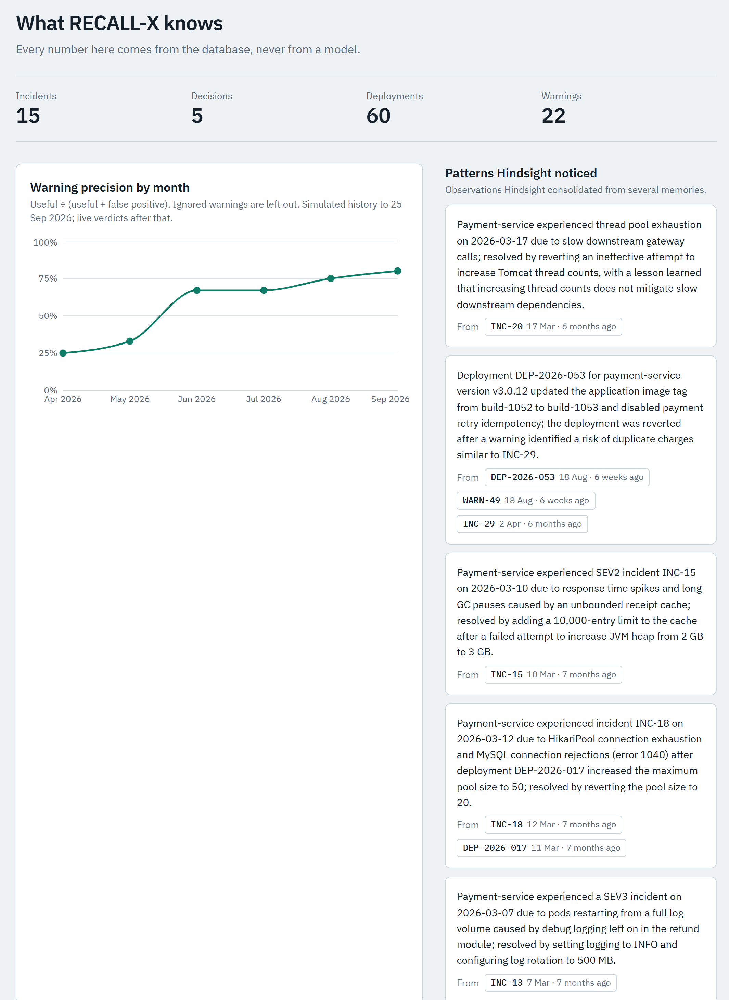
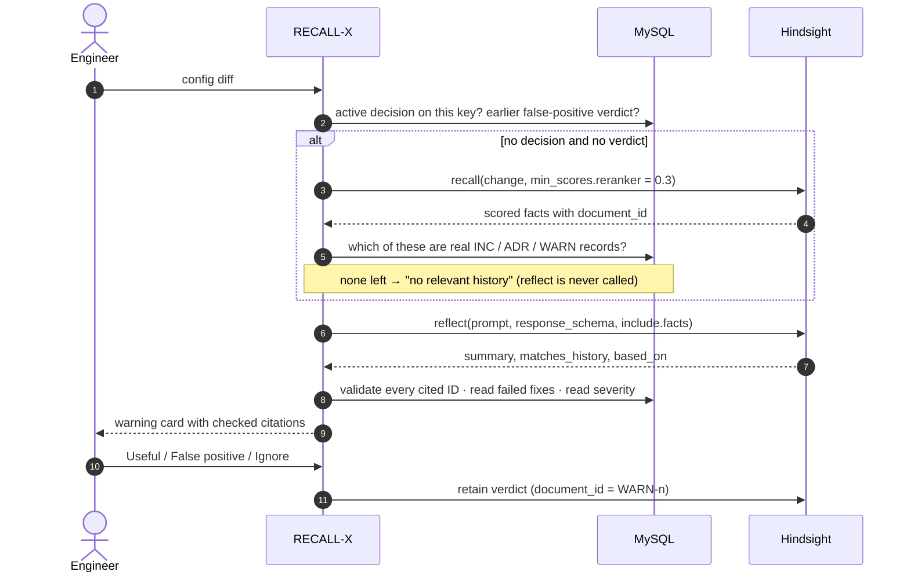
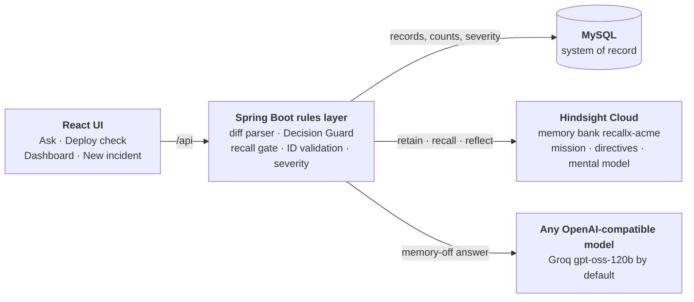

<div align="center">

# RECALL-X

### The engineering memory that remembers what failed, why things are set the way they are, and which of its own warnings were wrong.

Every config change and on-call question is checked against the team's history, using [Hindsight](https://github.com/vectorize-io/hindsight) agent memory.

[](https://github.com/desireddymohithreddy0925/Recall-X/actions/workflows/ci.yml)


[See it work](#see-it-work) · [How it uses Hindsight](#how-recall-x-uses-hindsight) · [Design](#the-rule-recall-decides-reflect-explains) · [Run it](#run-it-locally) · [Deep dive](docs/HINDSIGHT.md)

<!-- Demo video: add the YouTube link here once it's published. -->



<sub>The same question, role and format, answered twice. <b>Left:</b> gpt-oss-120b on its own. <b>Right:</b> Hindsight's reflect over the team's memory. Every cited record was checked against the database before it reached the screen.</sub>

</div>

---

## The problem

In March, a deployment at Acme Pay raised `spring.datasource.hikari.maximum-pool-size` from 20 to 50. Four replicas × 50 = 200 connections, above MySQL's limit of 150, and payments timed out (**INC-18**). The on-call engineer restarted the pods. That didn't help. Reverting the pool size did, and the team wrote a decision record: keep the pool at 20 (**ADR-7**).

In May, a different engineer saw timeouts and restarted the pods again. It failed again (**INC-31**).

Documentation wasn't what was missing: the postmortem and the decision both existed. Nobody read them at the two moments that matter, **while troubleshooting** and **right before a change ships**. RECALL-X puts that history in front of the engineer at exactly those moments.

## What it does

**Deploy check.** Paste a config diff and each changed key gets exactly one of four answers:

| | Outcome | When | Decided by |
|:-:|---|---|---|
| 🛡️ | **Decision Guard** | A recorded decision governs this value (ADR-7 keeps the pool at 20) | MySQL. Works even if memory is down |
| 🧠 | **History match** | No decision on file, but memory holds a matching incident (debug logging filled a disk in INC-13) | Hindsight recall, confirmed by reflect |
| ✅ | **Previously judged safe** | An engineer already marked this exact warning a false positive (WARN-42) | The team's own verdicts |
| 🤫 | **No relevant history** | Nothing in memory scores above the relevance floor | Hindsight recall. Reflect is never called |

**Ask.** A troubleshooting question answered side by side: by a model on its own, and by Hindsight reasoning over the team's memory, with record IDs, dates and the fixes that already failed.

**Learning loop.** Engineers mark each warning *Useful*, *False positive* (a reason is required) or *Ignore*. The verdict is retained as memory, so the same alarm isn't raised twice.

**Dashboard.** Counts and precision by month from the database, plus **patterns Hindsight noticed on its own**, each linked to the records it came from.

**New incident.** Record a closed incident, including the fixes that failed, and it goes straight into memory.

## See it work

<table>
<tr>
<td width="50%" valign="top">

**One diff, four answers.** A four-line change gets a Decision Guard warning, a history match found by memory alone, a "previously judged safe" card for a remembered false alarm, and silence for the unrelated line.

Each card shows:
- what was **tried before and failed**, read from the database
- the records it's **based on**, with dates and ages
- what Hindsight used: memories, the `payment-config-rules` mental model, and the directives it applied
- verdict buttons that feed the learning loop

</td>
<td width="50%">

</td>
</tr>
</table>

<details>
<summary><b>Dashboard: what RECALL-X knows</b></summary>
<br>

</details>

## How RECALL-X uses Hindsight

Hindsight isn't a vector store bolted on the side. Every Hindsight feature below does a job in the product:

| Hindsight feature | What RECALL-X does with it | Where |
|---|---|---|
| **Retain** with `document_id`, `timestamp`, `context`, `metadata` | Every incident, decision, deployment and verdict is retained under its record ID, dated when it happened. Re-sending replaces rather than duplicates, and every recall result traces back to a MySQL row. | [`MemorySyncService`](backend/src/main/java/com/recallx/recallx/memory/MemorySyncService.java), [`MemoryTemplates`](backend/src/main/java/com/recallx/recallx/memory/MemoryTemplates.java) |
| **Recall** with `min_scores.reranker` | The gate: does this change have *any* history? The query describes the change itself; weak matches are dropped inside Hindsight. | [`DecisionGuardService`](backend/src/main/java/com/recallx/recallx/guard/DecisionGuardService.java) |
| **Reflect** with `response_schema` | Writes each warning as structured JSON: `matches_history`, summary, citations, failed fixes, recommendation. | [`DecisionGuardService`](backend/src/main/java/com/recallx/recallx/guard/DecisionGuardService.java) |
| **Reflect** with `include.facts` → `based_on` | Every answer shows what it was based on: memories, mental model and directives. | [`BasedOn`](backend/src/main/java/com/recallx/recallx/memory/hindsight/BasedOn.java), [`SourcesLine`](frontend/src/components/SourcesLine.jsx) |
| **Bank mission and disposition** | "Prioritise root causes, fixes that failed, and the reasons behind configuration decisions". Skepticism 4, literalism 4, empathy 2. | [`BankSetup`](backend/src/main/java/com/recallx/recallx/memory/BankSetup.java) |
| **Directives** (6) | Cite record IDs, never invent history, name failed fixes, mention false positives, describe similarity (don't predict), newest decision wins. | [`BankSetup`](backend/src/main/java/com/recallx/recallx/memory/BankSetup.java) |
| **Mental model** `payment-config-rules` | Which values were set deliberately, what incident led to each, and what failed before. Reflect reads it first. | [`BankSetup`](backend/src/main/java/com/recallx/recallx/memory/BankSetup.java) |
| **Observations** with `source_facts` | The dashboard's "Patterns Hindsight noticed": beliefs Hindsight consolidated from several memories, linked to their source records. | [`PatternService`](backend/src/main/java/com/recallx/recallx/service/PatternService.java) |
| **Documents API** | Resetting the history deletes every post-seed document from memory too, so memory and database stay in step. | [`MemorySyncService`](backend/src/main/java/com/recallx/recallx/memory/MemorySyncService.java) |

All of it goes through one class, [`HindsightClient`](backend/src/main/java/com/recallx/recallx/memory/hindsight/HindsightClient.java), over Hindsight's REST API. The full design, with request examples, is in **[docs/HINDSIGHT.md](docs/HINDSIGHT.md)**.

## The rule: recall decides, reflect explains

Recall returns scored, traceable evidence, so the code makes decisions with it. Reflect writes explanations people can read, so the code uses its words and checks its lists.



**Safeguards**

- **Never invent history.** Every cited ID is checked against MySQL. Invented IDs are dropped, and a warning with no real reference isn't shown.
- **Decision Guard doesn't depend on AI.** An active decision always produces a warning from a database lookup, even with Hindsight or the model down.
- **Severity comes from the database**, never from a model.
- **A memory-only warning needs two agreeing sources:** reflect must say the history matches, and at least one incident must appear in both recall's results and reflect's summary.
- **Failures are said out loud.** If memory is unreachable, keys show "memory unavailable" (never "no history"), and Ask shows "Memory unavailable" instead of quietly falling back.
- **Honest comparison.** Both Ask answers get the same role, question and format ([`Prompts`](backend/src/main/java/com/recallx/recallx/llm/Prompts.java)), and each panel names its model.

## Measured, not guessed

Every threshold was set from real Hindsight responses ([`tools/hindsight_spike.py`](tools/hindsight_spike.py), results in [docs/SPIKE_RESULTS.md](docs/SPIKE_RESULTS.md)).

| Measurement | Result | What it changed |
|---|---|---|
| Recall score, pool-size change → ADR-7 | **0.88** | |
| Recall score, debug logging → INC-13 | **0.41** | The relevance floor sits at **0.3** |
| Recall score, unrelated keys (`server.compression.enabled`, `health.show-details`) | **0.25**, **0.03** | They stay quiet |
| Recalled facts that still contain their record ID in the text | **62%** | Matching uses `document_id`, not a regex |
| Retain → recallable | **2.7 s** | New incidents count almost immediately |
| Reflect latency and cost | **9–13 s**, **45k–100k tokens** | Budgets are configurable per path |
| The memory-free model inventing history when asked "what went wrong last quarter?" (8 runs each) | gpt-oss-120b **6/8**, qwen3.8-27b **2/8**, gemini-3.5-flash-lite **8/8** | This is the problem memory solves |

Real runs also showed that reflect's `cited_ids` listed nearly every record it read. So citations come from the IDs the summary actually names, failed fixes come from MySQL, and an "earlier false positive" note is kept only for the same setting.

## Architecture



API keys stay on the server and never reach the browser.

## Run it locally

**You need:** JDK 21+, Node 20+, MySQL 8 (or Docker), Python 3.9+ for the tools, a [Hindsight Cloud](https://ui.hindsight.vectorize.io) API key, and a key for any OpenAI-compatible model API ([Groq](https://groq.com) by default; Gemini works too, see `.env.example`).

**1. Settings.** Copy `.env.example` to `.env` and fill in `HINDSIGHT_API_KEY`, `LLM_API_KEY`, `DB_PASSWORD` and `RECALLX_ADMIN_TOKEN`. The backend reads this file directly. Use one `KEY=value` per line, with no quotes and no comments at the end of a line.

**2. Database.** Start MySQL in Docker:

```bash
docker compose up -d mysql
```

Or create it in a local MySQL:

```sql
CREATE DATABASE recallx;
CREATE USER 'recallx'@'localhost' IDENTIFIED BY 'change-me';
GRANT ALL ON recallx.* TO 'recallx'@'localhost';
```

**3. Backend** (port 8080). Liquibase creates the schema and loads the history on first start.

```bash
cd backend
./mvnw spring-boot:run          # macOS / Linux
.\mvnw.cmd spring-boot:run      # Windows PowerShell
```

**4. Seed memory** (once). This retains the history into Hindsight and sets up the bank's mission, directives and mental model.

```bash
curl -X POST -H "X-Admin-Token: <your token>" localhost:8080/api/admin/memory/sync
```

```powershell
Invoke-RestMethod -Method Post -Uri http://localhost:8080/api/admin/memory/sync -Headers @{ 'X-Admin-Token' = '<your token>' }
```

Hindsight processes the records in the background. It's ready when this returns `INC-18` and `ADR-7` in `recordIds`:

```bash
curl -H "X-Admin-Token: <your token>" "localhost:8080/api/admin/memory/check?q=payment-service%20maximum-pool-size"
```

**5. Frontend** (port 5173):

```bash
cd frontend
npm ci
npm run dev
```

Open **http://localhost:5173**.

> **New Hindsight account?** Run `python tools/hindsight_spike.py` first. It checks the API behaviour RECALL-X depends on against a throwaway bank and recommends `HINDSIGHT_RETAIN_PATH`, `HINDSIGHT_MIN_RERANKER` and `RECALLX_CHECK_BUDGET`.

### Try it in 60 seconds

1. **Ask:** click *"The payment API is timing out. What should I do?"* and compare the two panels.
2. **Deploy check:** click **Load demo change**, then **Check change**. You get four keys and four different answers.
3. Mark the pool-size warning **Useful**. The verdict is retained into Hindsight.
4. Reset afterwards so the next run starts from the same point:
   ```bash
   curl -X POST -H "X-Admin-Token: <your token>" localhost:8080/api/admin/demo/reset
   ```

The full runbook is in [docs/DEMO.md](docs/DEMO.md).

## Tests

```bash
cd backend && ./mvnw test        # 57 unit and contract tests; Hindsight and the model are mocked
python tools/smoke_test.py       # acceptance checklist against a running backend
```

`smoke_test.py` detects whether Hindsight is reachable and checks the matching behaviour: the full flow with memory up, or the fallbacks with memory down. It resets the history before and after. CI runs the backend tests, the frontend build and a content check on every push.

## About the data

Everything on screen is **simulated history** for Acme Pay, a fictional payments company, from March to September 2026: one service (`payment-service`, 4 replicas, MySQL `max_connections` 150), 15 incidents, 5 decisions, 60 deployments and 22 rated warnings. The numbers are kept consistent (4 × 50 = 200 connections is what broke the limit of 150 in INC-18), and the UI labels the history as simulated. The precision chart comes from that seed history, not from real use.

The history is generated by [`tools/gen_seed.py`](tools/gen_seed.py). Change the script and regenerate; don't edit the SQL by hand.

<details>
<summary><b>API reference</b></summary>
<br>

| Method | Path | Purpose |
|---|---|---|
| POST | `/api/ask` | Answer a question with memory off and on |
| POST | `/api/deployments/check` | Check a config diff (`dryRun: true` saves nothing) |
| POST | `/api/warnings/{id}/verdict` | Record Useful, False positive (with a reason) or Ignored, and retain it |
| GET | `/api/warnings` | Warnings, newest first |
| GET | `/api/stats` | Counts, precision by month, recent warnings |
| GET | `/api/patterns` | Observations from Hindsight, with their source records |
| GET | `/api/records/{id}` | One record's summary |
| GET | `/api/config-keys` | The canonical config keys |
| POST | `/api/incidents` | Record a closed incident and retain it |
| GET | `/api/health` | Health check |
| POST | `/api/admin/memory/sync` | Retain everything not yet in memory, then set up the bank (admin token) |
| GET | `/api/admin/memory/check?q=` | See what recall returns, with scores (admin token) |
| POST | `/api/admin/demo/reset` | Remove everything created after the seed, from MySQL and memory (admin token) |

Swagger UI: http://localhost:8080/swagger-ui.html

</details>

<details>
<summary><b>Project structure</b></summary>
<br>

```
Recall-X/
├── .env.example                  Settings template: copy to .env (git-ignored) and fill in the keys
├── .gitattributes                Line endings (LF for mvnw, CRLF for .cmd)
├── .gitignore
├── .github/workflows/ci.yml      Backend tests, frontend build, content check
├── docker-compose.yml            MySQL 8 for local runs
├── README.md
│
├── backend/                      Spring Boot 4.1, Java 21
│   ├── pom.xml
│   ├── mvnw, mvnw.cmd            Maven wrapper (no Maven install needed)
│   └── src/
│       ├── main/
│       │   ├── java/com/recallx/recallx/
│       │   │   ├── RecallXApplication.java
│       │   │   ├── api/                          REST controllers
│       │   │   │   ├── AskController.java             POST /api/ask
│       │   │   │   ├── DeploymentCheckController.java POST /api/deployments/check
│       │   │   │   ├── WarningController.java         GET /api/warnings, POST /api/warnings/{id}/verdict
│       │   │   │   ├── StatsController.java           GET /api/stats
│       │   │   │   ├── PatternsController.java        GET /api/patterns
│       │   │   │   ├── RecordController.java          GET /api/records/{id}
│       │   │   │   ├── ConfigKeyController.java       GET /api/config-keys
│       │   │   │   ├── IncidentController.java        POST /api/incidents
│       │   │   │   ├── AdminController.java           /api/admin: memory sync, memory check, demo reset
│       │   │   │   ├── HealthController.java          GET /api/health
│       │   │   │   └── ApiExceptionHandler.java       Error responses
│       │   │   ├── common/                       BadRequest, Conflict and NotFound exceptions
│       │   │   ├── config/
│       │   │   │   ├── RecallxProperties.java         All recallx.* settings, read from .env
│       │   │   │   ├── SecurityConfig.java            CORS, open API, admin endpoints behind a token
│       │   │   │   ├── AdminTokenFilter.java          Checks X-Admin-Token on /api/admin/**
│       │   │   │   └── StartupChecks.java             Warns at startup about missing keys
│       │   │   ├── guard/                        The deploy check
│       │   │   │   ├── DiffParser.java                Pasted diff -> config changes
│       │   │   │   ├── DecisionGuardService.java      Decision Guard, recall gate, reflect wording, ID checks
│       │   │   │   ├── KeyResult.java                 One outcome per changed key
│       │   │   │   ├── WarningView.java, ClearedView.java, CheckResponse.java
│       │   │   │   └── DiffParseException.java
│       │   │   ├── memory/                       Everything that goes into Hindsight
│       │   │   │   ├── MemorySyncService.java         Retains records not yet in memory
│       │   │   │   ├── MemoryTemplates.java           Record -> memory text
│       │   │   │   ├── BankSetup.java                 Mission, disposition, directives, mental model
│       │   │   │   ├── RecordIds.java                 Finds INC-, ADR-, DEP- and WARN- IDs in text
│       │   │   │   └── hindsight/
│       │   │   │       ├── HindsightClient.java       The only class that calls Hindsight (REST)
│       │   │   │       ├── RetainItem.java, RecallRequest.java, RecallResponse.java, RecallHit.java
│       │   │   │       ├── ReflectAnswer.java, BasedOn.java, Sources.java
│       │   │   │       └── MemoryUnavailableException.java
│       │   │   ├── llm/
│       │   │   │   ├── BaselineLlmClient.java         The memory-off answer (any OpenAI-compatible API)
│       │   │   │   └── Prompts.java                   Shared role and format for both answers
│       │   │   ├── service/
│       │   │   │   ├── AskService.java                Runs both answers side by side
│       │   │   │   ├── VerdictService.java            Saves a verdict and retains it as memory
│       │   │   │   ├── IncidentCaptureService.java    New incident -> MySQL and memory
│       │   │   │   ├── PatternService.java            Observations for the dashboard
│       │   │   │   ├── StatsService.java              Dashboard numbers, all from the database
│       │   │   │   └── DemoResetService.java          Removes everything created after the seed
│       │   │   └── store/                        JDBC access to MySQL
│       │   │       ├── IncidentStore.java, DecisionStore.java, DeploymentStore.java, WarningStore.java
│       │   │       ├── RecordLookup.java              Checks IDs exist; severity and summaries
│       │   │       ├── ResetStore.java, Jdbc.java
│       │   │       └── Incident, Decision, Deployment, Warning, FixAttempt, ConfigChange,
│       │   │           ClearedVerdict, Counts, MonthPrecision, RecordSummary   (row records)
│       │   └── resources/
│       │       ├── application.yml                   Reads .env; defaults for every setting
│       │       └── db/changelog/
│       │           ├── db.changelog-master.yaml
│       │           └── changes/
│       │               ├── 001-schema.sql            Tables
│       │               └── 002-seed-data.sql         Simulated history (generated by tools/gen_seed.py)
│       └── test/java/com/recallx/recallx/            57 tests; Hindsight and the model are mocked
│           ├── TestProperties.java
│           ├── config/AdminTokenFilterTest.java
│           ├── guard/DecisionGuardServiceTest.java, DiffParserTest.java
│           ├── llm/BaselineLlmClientTest.java
│           ├── memory/MemoryTemplatesTest.java, RecordIdsTest.java
│           ├── memory/hindsight/HindsightClientTest.java
│           └── service/AskServiceTest.java, PatternServiceTest.java, VerdictServiceTest.java
│
├── frontend/                     React 18, Vite 5, Tailwind 3, Recharts
│   ├── .env.example              Optional: VITE_BACKEND_URL for the dev proxy
│   ├── index.html
│   ├── package.json, package-lock.json
│   ├── vite.config.js            Proxies /api to the backend
│   ├── tailwind.config.js, postcss.config.js
│   └── src/
│       ├── main.jsx, App.jsx     Entry point, navigation
│       ├── api.js                Calls to the backend
│       ├── format.js             Dates and ages
│       ├── index.css
│       ├── pages/
│       │   ├── Ask.jsx                 Two answers side by side
│       │   ├── DeployCheck.jsx         Paste a diff, see each key's outcome, mark warnings
│       │   ├── Dashboard.jsx           Counts, precision by month, patterns, recent warnings
│       │   └── NewIncident.jsx         Record a closed incident
│       └── components/
│           ├── WarningCard.jsx         A warning with its records and verdict buttons
│           ├── ClearedCard.jsx         "Previously judged safe"
│           ├── VerdictButtons.jsx      Useful / False positive / Ignore
│           ├── RecordChip.jsx          Record ID with date and age
│           ├── SourcesLine.jsx         What reflect was based on
│           ├── StatusNotes.jsx         Simulated-data badge, memory status banner
│           ├── PrecisionChart.jsx
│           └── Markdown.jsx            Safe rendering of bullets, bold and code
│
├── tools/                        Python 3.9+, standard library only
│   ├── gen_seed.py               Generates 002-seed-data.sql
│   ├── hindsight_spike.py        Checks the Hindsight API against a throwaway bank
│   └── smoke_test.py             Acceptance checklist against a running backend
│
└── docs/
    ├── HINDSIGHT.md              How RECALL-X uses Hindsight, with request examples
    ├── DEMO.md                   Demo runbook
    ├── IMPLEMENTATION_PLAN.md    The plan and build status
    ├── SPIKE_RESULTS.md          Real results from hindsight_spike.py
    └── images/                   Screenshots used in this README
```

Not in the repository: `.env` (your keys), `backend/target/`, `frontend/node_modules/` and `frontend/dist/`.

</details>

## Limitations and what's next

- **One service, one team.** Warnings never cross services, because there's only one. Multi-service banks are next.
- **Diffs are pasted.** Pull-request integration, so the check runs as a PR status, is the next step.
- **"Previously judged safe" needs the same key and the same new value.** Broader matching (for example, "any retry change while idempotency is on") is future work.
- **No sign-in yet.** The API is open except for the admin endpoints.
- **Deploy-gate speed, not autocomplete speed.** Keys are checked in parallel, but a check still takes 10 to 20 seconds, because reflect explains each flagged key.
- **The history is simulated.** Precision numbers come from the seed data, not from real use.

## Built with

[Hindsight](https://github.com/vectorize-io/hindsight) by Vectorize for agent memory ([docs](https://hindsight.vectorize.io/), [what agent memory is](https://vectorize.io/what-is-agent-memory)) · Spring Boot · MySQL · Liquibase · React · Vite · Tailwind CSS · Recharts · Groq

Built by **Shaik Aayan Javed** and **[@desireddymohithreddy0925](https://github.com/desireddymohithreddy0925)**.
