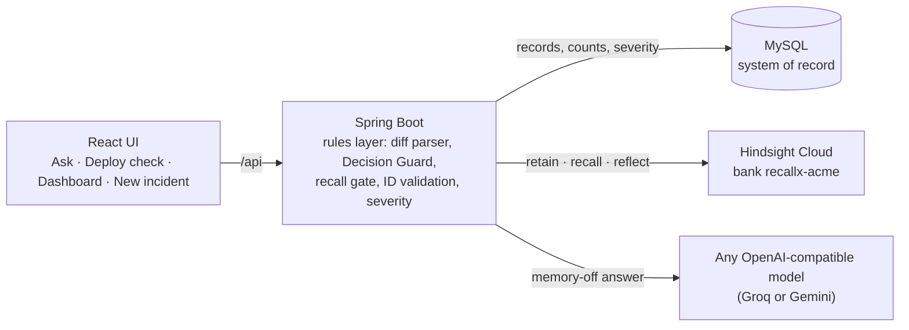

# RECALL-X

**An engineering memory that checks every config change and troubleshooting question against what your team already learned: what failed, why things are set the way they are, and which of its own warnings were wrong.** Built on [Hindsight](https://github.com/vectorize-io/hindsight) agent memory.

Demo video: *(link added after recording)*

---

## The problem

In March, a deployment at Acme Pay raised `spring.datasource.hikari.maximum-pool-size` from 20 to 50. Four replicas × 50 = 200 connections, above MySQL's limit of 150, and payments timed out (INC-18). The on-call engineer restarted the pods, which didn't help, and then reverted the pool size, which did. The team wrote a decision record: keep the pool at 20 (ADR-7).

In May, a different engineer saw timeouts and restarted the pods again. It failed again (INC-31).

Nothing in that story was caused by missing documentation. The postmortem and the decision existed; nobody read them at the moment it mattered. RECALL-X puts that history in front of the engineer while they're troubleshooting and before a change ships.

## What it does

| Screen | What you see |
|---|---|
| **Ask** | One question answered twice, side by side: by a model on its own, and by Hindsight reasoning over the team's memory. The memory answer cites real incidents and decisions, with dates, and says which fixes already failed. |
| **Deploy check** | Paste a config diff. Each changed key gets one of four outcomes: a **Decision Guard** warning (the value was set deliberately), a **history match** found by memory alone, **previously judged safe** (an engineer already marked this exact warning a false positive), or a quiet "no relevant history". Mark each warning Useful, False positive or Ignore. |
| **Dashboard** | Counts from the database, warning precision by month, patterns Hindsight noticed on its own, and recent warnings with their verdicts. |
| **New incident** | Record a closed incident in two minutes, including the fixes that failed. It goes straight into memory. |

## How RECALL-X uses Hindsight

- **Retain:** every incident, decision, deployment and warning verdict is retained with its record ID as `document_id` and its real date as `timestamp`, so six months of history behave like six months.
- **Recall:** decides whether a change has any history at all. Results are matched to records by `document_id` and filtered with a relevance floor (`min_scores.reranker`), so an unrelated change gets no warning.
- **Reflect:** writes every answer people read, as structured output with citations, shaped by the bank's mission, disposition, six directives and a mental model. Every cited ID is checked against MySQL, and invented IDs never reach the screen.
- **Observations:** Hindsight's own consolidated patterns appear on the dashboard with the records they came from.
- **Learning:** each verdict is retained as memory. The same change with a false-positive verdict comes back as "previously judged safe" instead of the same alarm.

The full design, with request examples: **[docs/HINDSIGHT.md](docs/HINDSIGHT.md)**.

## Architecture



The code decides with recall; people read reflect. API keys stay on the server and never reach the browser.

## Run it locally

You need JDK 21 or newer, Node 20 or newer, MySQL 8 (or Docker), and Python 3.9 or newer for the tools. You also need a [Hindsight Cloud](https://ui.hindsight.vectorize.io) API key and a key for any OpenAI-compatible model API, used for the memory-off answer: [Groq](https://groq.com), or Gemini through its OpenAI-compatible endpoint (see `.env.example`).

1. **Settings.** Copy `.env.example` to `.env` and fill in `HINDSIGHT_API_KEY`, `LLM_API_KEY`, `DB_PASSWORD` and `RECALLX_ADMIN_TOKEN`. The backend reads this file directly, so there's nothing to export. Write one `KEY=value` per line, with no quotes and no comments at the end of a line.

2. **Database.** Either start MySQL in Docker:
   ```bash
   docker compose up -d mysql
   ```
   or create the database in a local MySQL:
   ```sql
   CREATE DATABASE recallx;
   CREATE USER 'recallx'@'localhost' IDENTIFIED BY 'change-me';
   GRANT ALL ON recallx.* TO 'recallx'@'localhost';
   ```

3. **Backend** (port 8080). Liquibase creates the schema and loads the simulated history on first start.
   ```bash
   cd backend
   ./mvnw spring-boot:run          # macOS / Linux
   .\mvnw.cmd spring-boot:run      # Windows PowerShell
   ```

4. **Seed memory** (once). This retains the history into Hindsight and sets up the bank's mission, directives and mental model.
   ```bash
   curl -X POST -H "X-Admin-Token: <your token>" localhost:8080/api/admin/memory/sync
   # PowerShell:
   Invoke-RestMethod -Method Post -Uri http://localhost:8080/api/admin/memory/sync -Headers @{ 'X-Admin-Token' = '<your token>' }
   ```
   Hindsight processes the records in the background. Check when they're searchable:
   ```bash
   curl -H "X-Admin-Token: <your token>" "localhost:8080/api/admin/memory/check?q=payment-service%20maximum-pool-size"
   ```
   It's ready when `recordIds` includes `INC-18` and `ADR-7`.

5. **Frontend** (port 5173):
   ```bash
   cd frontend
   npm ci
   npm run dev
   ```
   Open http://localhost:5173.

The first time you use a new Hindsight account, run `python tools/hindsight_spike.py`. It checks the API behaviour RECALL-X depends on against a throwaway bank, then writes the recommended `HINDSIGHT_RETAIN_PATH`, `HINDSIGHT_MIN_RERANKER` and `RECALLX_CHECK_BUDGET` to `docs/SPIKE_RESULTS.md`.

## Tests

```bash
cd backend && ./mvnw test                  # unit and client contract tests; Hindsight and the model are mocked
python tools/smoke_test.py                 # the acceptance checklist, against a running backend
```

`smoke_test.py` resets the demo, detects whether Hindsight is reachable, and checks the matching behaviour: the full demo with memory up, or the fallbacks with memory down. It resets again when it finishes. CI runs the backend tests, the frontend build, and a check that the banned word from the content guide appears nowhere in the repository.

## About the data

Everything on screen is **simulated history** for Acme Pay, a fictional payments company, from 2 March to 25 September 2026. It has one service (`payment-service`, 4 replicas, MySQL `max_connections` 150), 15 incidents, 5 decisions, 60 deployments and 22 rated warnings. The numbers are kept consistent: for example, 4 × 50 = 200 connections is what broke the 150 limit in INC-18. The UI labels the history as simulated.

The history is generated by `tools/gen_seed.py`. Change the script and regenerate; never edit the SQL by hand. `POST /api/admin/demo/reset` removes everything created after the seed, so a demo can run again from the same starting point.

## API

| Method | Path | Purpose |
|---|---|---|
| POST | `/api/ask` | Answer a question with memory off and on |
| POST | `/api/deployments/check` | Check a config diff (`dryRun: true` saves nothing) |
| POST | `/api/warnings/{id}/verdict` | Record Useful, False positive (with a reason) or Ignored, and retain it |
| GET | `/api/warnings` | Warnings, newest first |
| GET | `/api/stats` | Counts, precision by month, recent warnings |
| GET | `/api/patterns` | Observations from Hindsight, with their source records |
| GET | `/api/records/{id}` | One record's summary |
| GET | `/api/config-keys` | The canonical config keys |
| POST | `/api/incidents` | Record a closed incident and retain it |
| POST | `/api/admin/memory/sync` | Retain everything not yet in memory, then set up the bank (admin token) |
| GET | `/api/admin/memory/check?q=` | See what recall returns, with scores (admin token) |
| POST | `/api/admin/demo/reset` | Remove everything created after the seed (admin token) |

Swagger UI: http://localhost:8080/swagger-ui.html

## Project structure

```
Recall-X/
├── .env.example                  Settings template: copy to .env (git-ignored) and fill in the keys
├── .gitattributes                Line endings (LF for mvnw, CRLF for .cmd)
├── .gitignore
├── .github/workflows/ci.yml      Backend tests, frontend build, banned-word check
├── docker-compose.yml            MySQL 8 for local runs
├── README.md
│
├── backend/                      Spring Boot 4.1, Java 21
│   ├── pom.xml
│   ├── mvnw, mvnw.cmd            Maven wrapper (no Maven install needed)
│   └── src/
│       ├── main/
│       │   ├── java/com/recallx/recallx/
│       │   │   ├── RecallXApplication.java
│       │   │   ├── api/                          REST controllers
│       │   │   │   ├── AskController.java             POST /api/ask
│       │   │   │   ├── DeploymentCheckController.java POST /api/deployments/check
│       │   │   │   ├── WarningController.java         GET /api/warnings, POST /api/warnings/{id}/verdict
│       │   │   │   ├── StatsController.java           GET /api/stats
│       │   │   │   ├── PatternsController.java        GET /api/patterns
│       │   │   │   ├── RecordController.java          GET /api/records/{id}
│       │   │   │   ├── ConfigKeyController.java       GET /api/config-keys
│       │   │   │   ├── IncidentController.java        POST /api/incidents
│       │   │   │   ├── AdminController.java           /api/admin: memory sync, memory check, demo reset
│       │   │   │   ├── HealthController.java          GET /api/health
│       │   │   │   └── ApiExceptionHandler.java       Error responses
│       │   │   ├── common/                       BadRequest, Conflict and NotFound exceptions
│       │   │   ├── config/
│       │   │   │   ├── RecallxProperties.java         All recallx.* settings, read from .env
│       │   │   │   ├── SecurityConfig.java            CORS, open API, admin endpoints behind a token
│       │   │   │   ├── AdminTokenFilter.java          Checks X-Admin-Token on /api/admin/**
│       │   │   │   └── StartupChecks.java             Warns at startup about missing keys
│       │   │   ├── guard/                        The deploy check
│       │   │   │   ├── DiffParser.java                Pasted diff -> config changes
│       │   │   │   ├── DecisionGuardService.java      Decision Guard, recall gate, reflect wording, ID checks
│       │   │   │   ├── KeyResult.java                 One outcome per changed key
│       │   │   │   ├── WarningView.java, ClearedView.java, CheckResponse.java
│       │   │   │   └── DiffParseException.java
│       │   │   ├── memory/                       Everything that goes into Hindsight
│       │   │   │   ├── MemorySyncService.java         Retains records not yet in memory
│       │   │   │   ├── MemoryTemplates.java           Record -> memory text
│       │   │   │   ├── BankSetup.java                 Mission, disposition, directives, mental model
│       │   │   │   ├── RecordIds.java                 Finds INC-, ADR-, DEP- and WARN- IDs in text
│       │   │   │   └── hindsight/
│       │   │   │       ├── HindsightClient.java       The only class that calls Hindsight (REST)
│       │   │   │       ├── RetainItem.java, RecallRequest.java, RecallResponse.java, RecallHit.java
│       │   │   │       ├── ReflectAnswer.java, BasedOn.java, Sources.java
│       │   │   │       └── MemoryUnavailableException.java
│       │   │   ├── llm/
│       │   │   │   ├── BaselineLlmClient.java         The memory-off answer (any OpenAI-compatible API)
│       │   │   │   └── Prompts.java                   Shared role and format for both answers
│       │   │   ├── service/
│       │   │   │   ├── AskService.java                Runs both answers side by side
│       │   │   │   ├── VerdictService.java            Saves a verdict and retains it as memory
│       │   │   │   ├── IncidentCaptureService.java    New incident -> MySQL and memory
│       │   │   │   ├── PatternService.java            Observations for the dashboard
│       │   │   │   ├── StatsService.java              Dashboard numbers, all from the database
│       │   │   │   └── DemoResetService.java          Removes everything created after the seed
│       │   │   └── store/                        JDBC access to MySQL
│       │   │       ├── IncidentStore.java, DecisionStore.java, DeploymentStore.java, WarningStore.java
│       │   │       ├── RecordLookup.java              Checks IDs exist; severity and summaries
│       │   │       ├── ResetStore.java, Jdbc.java
│       │   │       └── Incident, Decision, Deployment, Warning, FixAttempt, ConfigChange,
│       │   │           ClearedVerdict, Counts, MonthPrecision, RecordSummary   (row records)
│       │   └── resources/
│       │       ├── application.yml                   Reads .env; defaults for every setting
│       │       └── db/changelog/
│       │           ├── db.changelog-master.yaml
│       │           └── changes/
│       │               ├── 001-schema.sql            Tables
│       │               └── 002-seed-data.sql         Simulated history (generated by tools/gen_seed.py)
│       └── test/java/com/recallx/recallx/            57 tests; Hindsight and the model are mocked
│           ├── TestProperties.java
│           ├── config/AdminTokenFilterTest.java
│           ├── guard/DecisionGuardServiceTest.java, DiffParserTest.java
│           ├── llm/BaselineLlmClientTest.java
│           ├── memory/MemoryTemplatesTest.java, RecordIdsTest.java
│           ├── memory/hindsight/HindsightClientTest.java
│           └── service/AskServiceTest.java, PatternServiceTest.java, VerdictServiceTest.java
│
├── frontend/                     React 18, Vite 5, Tailwind 3, Recharts
│   ├── .env.example              Optional: VITE_BACKEND_URL for the dev proxy
│   ├── index.html
│   ├── package.json, package-lock.json
│   ├── vite.config.js            Proxies /api to the backend
│   ├── tailwind.config.js, postcss.config.js
│   └── src/
│       ├── main.jsx, App.jsx     Entry point, navigation
│       ├── api.js                Calls to the backend
│       ├── format.js             Dates and ages
│       ├── index.css
│       ├── pages/
│       │   ├── Ask.jsx                 Two answers side by side
│       │   ├── DeployCheck.jsx         Paste a diff, see each key's outcome, mark warnings
│       │   ├── Dashboard.jsx           Counts, precision by month, patterns, recent warnings
│       │   └── NewIncident.jsx         Record a closed incident
│       └── components/
│           ├── WarningCard.jsx         A warning with its records and verdict buttons
│           ├── ClearedCard.jsx         "Previously judged safe"
│           ├── VerdictButtons.jsx      Useful / False positive / Ignore
│           ├── RecordChip.jsx          Record ID with date and age
│           ├── SourcesLine.jsx         What reflect was based on
│           ├── StatusNotes.jsx         Simulated-data badge, memory status banner
│           ├── PrecisionChart.jsx
│           └── Markdown.jsx            Safe rendering of bullets, bold and code
│
├── tools/                        Python 3.9+, standard library only
│   ├── gen_seed.py               Generates 002-seed-data.sql
│   ├── hindsight_spike.py        Checks the Hindsight API against a throwaway bank
│   └── smoke_test.py             Acceptance checklist against a running backend
│
└── docs/
    ├── HINDSIGHT.md              How RECALL-X uses Hindsight, with request examples
    ├── DEMO.md                   Demo runbook
    ├── IMPLEMENTATION_PLAN.md    The plan and build status
    └── SPIKE_RESULTS.md          Real results from hindsight_spike.py
```

Not in the repository: `.env` (your keys), `backend/target/`, `frontend/node_modules/` and `frontend/dist/`.

## Limitations

- One service and one team. Warnings never cross services, because there is only one.
- No sign-in yet: the API is open except for the admin endpoints.
- Deployments are entered by pasting a diff. Pull-request integration is the next step.
- A "previously judged safe" match needs the same key and the same new value. Broader matching is future work.
- The history is simulated. Precision numbers for April to September come from the seed data, not from real use.
